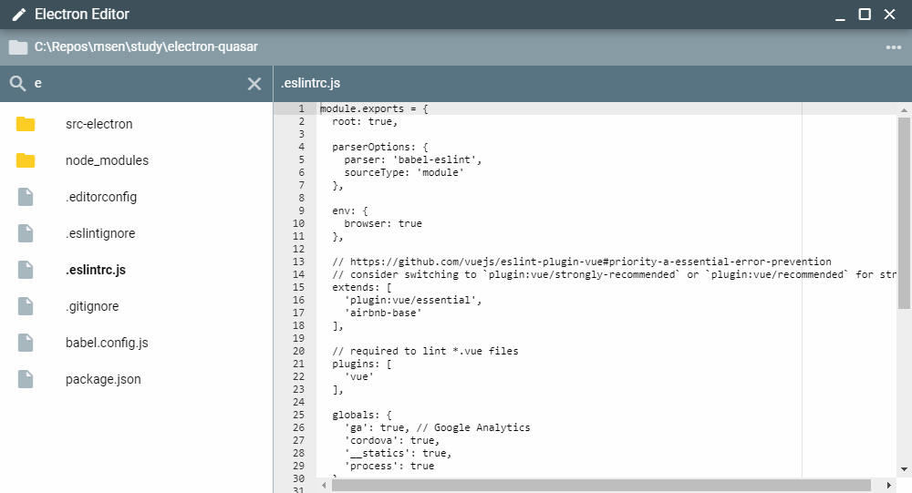

# Electron Editor (electron-editor)

An Electron-based simplest text editor made for a MSEN workshop.

## Detail

See [the presentation](docs/presentation.md) for the detail.

## License

Copyright (c) 2019 MSEN Inc, Kenji YAMADA

[MIT License](http://en.wikipedia.org/wiki/MIT_License)
