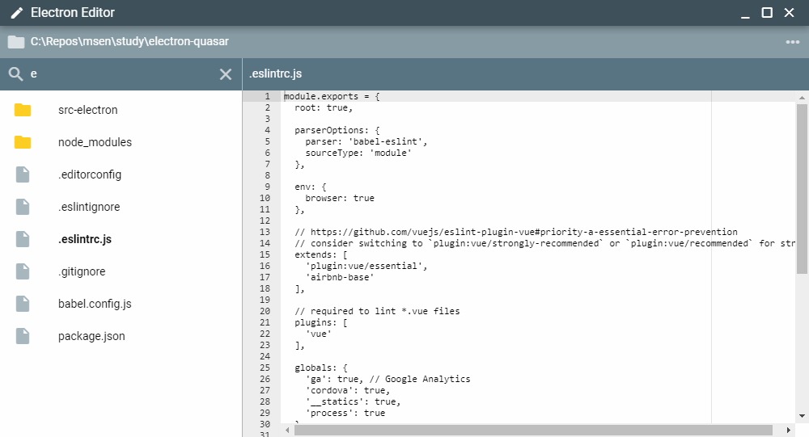

# Electron で作るテキストエディタ

```js
{
  date: '2019-07-20',
  author: 'kenzauros',
}
```

---

## 今日の内容

---

### 外観

こんな感じのアプリをつくります



---

### 主な機能

- フォルダ選択 (ファイル一覧から選択 or ダイアログ)
- フォルダパス表示
- ファイル一覧表示
- ファイル絞り込み (正規表現)
- ファイル内容表示 (エディター)
- ウィンドウの最小化/最大化/閉じる

---

### 目的

- Vue.js と Electron をさらに知る
- 高度なフレームワークにふれる
- 自分で開発できる素地をつくる

<br>

### 方針

CSS, HTML, JavaScript などの細かいところは掘り下げません

ソフト開発にありがちな**「なにからはじめたらいいのかわからない」**を解消することを第一目標とします

---

### モチベーション

なぜテキストエディタをつくるのか

- みんな使ったことがある (使っている)
    - エンジニアにとって、身近で動いているものがどうやって作られているかを知ることは、とても大事
- ソフトウェアの基本的なものが詰まっている
    - ファイルパス操作
    - ファイル I/O
    - リスト (配列) 操作
    - 文字列操作
    - 正規表現
    - etc...

---

### 今回使うもの

- [Node.js (+npm)](https://nodejs.org/ja/)
- [Electron](https://electronjs.org/)
- [Vue.js](https://jp.vuejs.org/)
- [Quasar Framework](https://quasar.dev/)
- [Ace](https://ace.c9.io/)

---

### What is Electron?

- GitHub がつくったソフトウェアフレームワーク
- Node.js + Chromium (Google Chrome のブラウザーコア)
- みなさん Electron で作られたアプリにはお世話になっていますね
    - Slack
    - Visual Studio Code
    - Atom

### Why Electron?

- Web 技術 (HTML, CSS, JavaScript など) が使える
- クロスプラットフォーム (macOS, Windows, Linux)
- オープンソース
- **商用利用可能**

---

### Vue.js

[Vue.js](https://jp.vuejs.org/) は Web アプリケーション開発要の JavaScript フレームワークです

- 2014年2月リリース
- オープンソース
- 概念は MVVM (Model-View-ViewModel) ベース

> 「Angularの本当に好きだった部分を抽出して、余分な概念なしに本当に軽いものを作ることができたらどうだろうか？」 - Evan You

---

### Quasar Framework

[Quasar Framework](https://quasar.dev/) は Vue.js をベースとした超多機能なアプリ開発フレームワークです

- SPA (Single Page App)
- SSR (Server-side Rendered) 対応
- PWA (Progressive Web App) 対応
- モバイルアプリ対応 (Apache Cordova 利用)
- **デスクトップアプリ対応 (Electron 利用)**

発音は `クウェイサー` が近いはず

---

### Ace

[Ace](https://ace.c9.io/) はブラウザ上でとても簡単にリッチなテキストエディターが実現できる JavaScript のライブラリです


シンタックスハイライト (テーマ対応), ショートカットキーのカスタマイズ, 正規表現による検索・置換, 対応するカッコの強調表示 などなど

> **COMMENT**: 本当はエディター部分を自作するのが一番勉強になるのですが、講習レベルではなくなるので割愛して Ace を使わせてもらいます

---

## 開発環境セットアップ

---

### インストール

```bash
$ cd c:\repos
$ npm install -g quasar-cli
$ quasar create electron-editor

? Project name (internal usage for dev)
    electron-editor
? Project product name
    ElectronEditor
? Project description
    hogehoge
? Author
    YOUR NAME
? Check the features needed for your project:
    ESLint
? Pick an ESLint preset
    Airbnb
? Cordova id (disregard if not building mobile apps)
    org.cordova.quasar.app
? Should we run `npm install` for you after the project has been created?
    yarn
```

※git bash だとプロンプトがうまく動作しないことがあるためコマンドプロンプトを推奨

---

### インストール

```bash
$ cd electron-editor/
$ npm install ace-min-noconflict -S
$ quasar mode add electron
$ code .
```

`quasar.conf.js` の `framework.all` を `true` にしましょう

```js
    framework: {
      // iconSet: 'ionicons-v4',
      lang: 'ja', // Quasar language

      all: true, // ← これのコメントアウトを解除
```

これで Quasar Framework の全モジュールが利用できるようになります

---

### 開発環境の起動

```bash
$ quasar dev -m electron
```

Electron が起動すれば OK です


この状態で Git を初期化してコミットしておきましょう

```bash
$ git init
$ git add .
$ git commit -m "Initial commit"
```

---

## 開発実践

---

### Quasar のビュー構造

ビュー (UI) の構成には `src` 以下の下記のフォルダーを使います

- `layouts`: レイアウト (枠組み)
- `pages`: ページ (内容)
- `components`: 自分で作るコンポーネント

インストール直後の状態では下記のようになっています

- `layouts/MyLayout.vue`
    - `pages/Index.vue`

---

### 編集してみよう

`layouts/MyLayout.vue` を開いて、このへんを変えてみましょう

```html
<q-toolbar-title>
  Quasar App
</q-toolbar-title>
```

このへんとかも好きなだけ変えてみましょう

```html
<q-item clickable tag="a" target="_blank" href="https://quasar.dev">
  <q-item-section avatar>
    <q-icon name="school" />
  </q-item-section>
  <q-item-section>
    <q-item-label>Docs</q-item-label>
    <q-item-label caption>quasar.dev</q-item-label>
  </q-item-section>
</q-item>
```

変になったら `git reset --hard HEAD` でリセットしましょう

---

### 編集してみよう

今度はページの中身である `src/pages/Index.vue` を開いて、自由に触ってみましょう

---

### Vue (Single File Component) を知る

1. `.vue` ファイルの基本構造
1. `script` の主な構成
1. `script` の例

---

### `.vue` ファイルの基本構造

```html
<template>
  <!-- HTML (的なもの) を書く -->
</template>

<style>
  /* CSS を書く */
</style>

<script>
  // データ・ロジックを書く
</script>
```

---

### `script` の主な構成

```js
<script>
export default {
  name: 'HogeHoge', // コンポーネントの名前
  props: {
    // 親から渡すプロパティ (書き換え不可)
  },
  data() {
    // このコンポーネント内で使うデータ変数 (書き換え可)
  },
  computed: {
    // 自動算出プロパティ (読み取り専用)
  },
  methods: {
    // このコンポーネント内で使うメソッド群
  },
  mounted() {
    // このコンポーネントが最初に初期化されたときに処理する内容
  },
};
</script>
```

この概形を `src/pages/Index.vue` に記述しましょう

---

### `script` の例

```js
export default {
  name: 'HogeHoge', // コンポーネントの名前
  data() { // 注: オブジェクトを返す
    return {
      data1: 100,
    };
  },
  computed: {
    // 自動算出プロパティ (読み取り専用)
    // 注: 関数のように書く
    computed1() {
      return this.data1 + 200;
    },
  },
  methods: {
    method1(text) {
      console.log(text);
    },
  },
  mounted() {
    // methods や props などは this で参照できる
    this.method(this.computed1); // 300
  },
};
```

---

## 実装

---

### 実装の流れ

1. データ変数を用意する
1. フォルダのファイルを読み取る
1. ファイル一覧を表示する
1. フォルダパスを表示する
1. Ace エディターを表示する
1. エディターにファイルの内容を表示する
1. フォルダがクリックされたときにカレントフォルダを切り替える
1. カレントフォルダをダイアログで切り替える

---

### データ変数を用意する

```js
data() {
  return {
    currentDir: process.cwd(), // 選択中のフォルダパス
    currentFile: null, // 選択中のファイル
    filterPattern: '', // 絞り込み用フィルター文字列
    list: [], // フォルダのアイテムの配列
    editor: null, // Ace エディターのオブジェクト
  };
},
```

---

### フォルダのファイルを読み取る

`fs` モジュールを読み込ませます

```js
import fs from 'fs';
```

`methods` に下記のメソッドを追加します

```js
loadItems() {
  fs.readdir(this.currentDir, (err, files) => {
    if (err) throw err;
    this.list = files.map((file) => {
      console.log(file);
      return null;
    });
  });
},
```


---

### フォルダのファイルを読み取る

`mounted` から呼び出してみます

```js
mounted() {
  this.loadItems();
},
```

下記のように表示されれば OK です


---

### フォルダのファイルを読み取る

`loadItems` でファイル一覧の配列を生成するように変更します

```js
loadItems() {
  fs.readdir(this.currentDir, (err, files) => {
    if (err) throw err;
    this.list = files.map((file) => {
      const isFile = fs.statSync(file).isFile();
      return {
        name: file,
        isFile,
      };
    });
  });
},
```

> **NOTE**: `fs.statSync` でファイルの属性が取得できます

> **THINK**: ここで `this.list` に格納されるオブジェクトのイメージを想像しましょう

---

### フォルダのファイルを読み取る

こんな感じで常にメモリー上のオブジェクトのイメージを頭に描くことが重要です

```js
[
  {
    name: 'ファイル1',
    isFile: true,
  },
  {
    name: 'フォルダ1',
    isFile: false,
  },
  ...
]
```

---

### ファイル一覧を表示する

HTML で基本的な骨組みをつくりましょう

```html
<template>
  <q-page>
    <div class="row q-px-sm bg-blue-grey-5">
      <!-- ヘッダー (フォルダパス) -->
    </div>
    <div class="row">
      <div class="col col-grow list-col">
        <!-- フィルターテキストボックス -->
        <!-- ファイル一覧 -->
      </div>
      <div class="col editor-col">
        <!-- ファイルパス -->
        <!-- エディター -->
      </div>
    </div>
  </q-page>
</template>

```

emmet: `.row.q-px-sm.bg-blue-grey-5+.row>.col.col-grow.list-col+.col.editor-col`

---

### ファイル一覧を表示する

スタイルを定義します (ここはコピペで OK です)

```html
<style lang="stylus" scoped>
.q-page
  height 100%
  min-height 100%
  display flex
  flex-direction column
  > :nth-child(1)
    flex 0 0 auto
  > :last-child
    flex 1 0 0
.editor-col, .list-col
  display flex
  flex-direction column
  > :last-child
    flex 1 0 0
    overflow auto
.list-col
  width 30%
  max-width 30%
  border-right solid 1px $blue-grey-3
</style>
```

---

### ファイル一覧を表示する

ファイル一覧部分のビューを実装しましょう

```html
<!-- ファイル一覧 -->
<q-list dense>
  <q-item clickable
    v-for="item in list" :key="`item_${item.name}`"
    >
    <q-item-section>{{ item.name }}</q-item-section>
  </q-item>
</q-list>
```

> **NOTE**: `v-for` と `:key` と `{{ }}` がミソです

---

### ファイル一覧を表示する

一覧にアイコンを追加してみましょう

`q-item` の下に `<q-item-section avatar>` と `<q-icon>` を追加します

```html
<q-item-section avatar>
  <q-icon
    color="blue-grey-3"
    name="insert_drive_file"
    />
</q-item-section>
```

> **NOTE**: `insert_drive_file` のところは Material Design Icons の好きなアイコン名を指定すれば OK です<br>
> - [Icons - Material Design](https://material.io/tools/icons/?style=baseline)

---

### ファイル一覧を表示する

フォルダもファイルみたいなアイコンだと気持ち悪いので、アイコンを変えてみましょう

```html
<q-item-section avatar>
  <q-icon
    color="blue-grey-3"
    v-bind:name="item.isFile ? 'insert_drive_file' : 'folder'"
    />
</q-item-section>
```

> **NOTE**: 動的に値を設定するには `v-bind:hoge="値"` のように `v-bind` を使ってバインディングするのがミソです<br>
ちなみに `v-bind:` は `:` に省略できます

#### TO DO

同様に `color` も変えてみましょう (フォルダの場合は `yellow-14` にしましょう)

---

### ファイル一覧を表示する

下記のようになれば OK です (順番は違っていても OK)


---

### フォルダパスを表示する

ここまでくれば、フォルダパスの表示部分を実装するのは難しくありません。

```html
<!-- ヘッダー (フォルダパス) -->
<div class="col-xs-12">
  <q-input dense dark borderless :value="currentDir">
    <template v-slot:prepend>
      <q-icon name="folder" />
    </template>
    <template v-slot:append>
      <q-icon name="more_horiz" class="cursor-pointer"
        />
    </template>
  </q-input>
</div>
```

> **MEMO**: Quasar のコンポーネント (`q-` なんたら) については、リファレンスを読みながら、少しずつ覚えていくしかありません
> - [Vue Components](https://quasar.dev/vue-components/)

---

### 表示するファイルを絞り込む

ファイル一覧の上のテキストボックスを使って、ファイル一覧のアイテムを絞り込めるようにしましょう

まずテキストボックスにフィルター文字列を格納する `filterPattern` をバインドします

```html
<!-- フィルターテキストボックス -->
<div class="bg-blue-grey-6">
  <q-input dense dark borderless class="q-mx-sm"
    v-model="filterPattern"
    >
  </q-input>
</div>
```

これでテキストボックスに文字列を入力すると `filterPattern` が更新されます

> **MEMO**: **`v-model`** で**双方向バインディング**が実現できます

---

### 表示するファイルを絞り込む

次に `filterPattern` で絞り込んだファイル一覧にする自動算出プロパティ (`computed`) を追加します

```js
computed: {
  displayItems() {
    if (!this.filterPattern) return this.list;
    const regex = new RegExp(this.filterPattern);
    return this.list.filter(x => regex.test(x.name));
  },
},
```

表示側も `list` をやめて `displayItems` を使うように変更します

```html
<q-item clickable class="q-mr-md q-mt-sm"
  v-for="item in displayItems" :key="`item_${item.name}`"
```

実際にフィルター文字列を入力してみましょう

---

### Ace エディターを表示する

テキスト編集機能 (エディター) を作りましょう

まずエディター表示部分に空の `div` タグを置きます

```html
<!-- エディター -->
<div id="editor"></div>
```

この部分が Ace エディターになります

---

### Ace エディターを表示する

Ace エディターのモジュールを読み込みます

```js
import 'ace-min-noconflict';
```

`mounted` で `ace.edit('editor')` を呼び出し、 `div#editor` を Ace エディターとして初期化します

```js
mounted() {
  this.editor = window.ace.edit('editor');
  this.loadItems();
},
```

Ace エディターは他のところでも使用するので `this.editor` に格納しておきます

画面にエディターが表示されれば OK です

---

### エディターにファイルの内容を表示する

ファイル一覧でファイル名をクリックしたときに呼び出す `setCurrentItem` メソッドを `methods` に追加します

```js
setCurrentItem(item) {
  if (item.isFile) {
    this.currentFile = item;
    fs.readFile(item.absolutePath, 'utf8', (err, data) => {
      this.editor.setValue(data, -1);
    });
  }
},
```

`fs.readFile` でファイルを読み込み、 `editor.setValue` でエディターに設定します

ただしここで **`item` に `absolutePath` がないためエラーが発生**します

---

### エディターにファイルの内容を表示する

ファイルを開くために、ファイル一覧の各アイテムに絶対パスを追加します

ファイル一覧のオブジェクト構造を再度イメージし、下記のようになるように変更しましょう

```js
[
  {
    name: 'ファイル1',
    aboslutePath: 'C:\path\to\ファイル1', // 追加
    isFile: true,
  },
  {
    name: 'フォルダ1',
    aboslutePath: 'C:\path\to\フォルダ1', // 追加
    isFile: false,
  },
  ...
]
```

---

### エディターにファイルの内容を表示する

**絶対パスは `path.resolve` でカレントフォルダとファイル名を結合**して作ります

```js
const absolutePath = path.resolve(フォルダ, ファイル名);
```

`path` モジュールは `fs` などと同様に `import` で読み込みます

```js
import path from 'path';
```

> **THINK**: なぜ `currentDir + file` のように文字列結合するのでなく `path.resolve` を使うのか考えてみてください

---

### エディターにファイルの内容を表示する

絶対パスを追加したファイル一覧生成のサンプルコード

```js
this.list = files.map((file) => {
  const absolutePath = path.resolve(this.currentDir, file); // 追加
  const isFile = fs.statSync(absolutePath).isFile(); // 変更
  return {
    name: file,
    absolutePath, // 追加
    isFile,
  };
});
```

---

### エディターにファイルの内容を表示する

あとは画面上のファイル一覧のアイテムがクリックされたときに `setCurrentItem` を呼び出すようにします

`q-item` の `click` イベントに `setCurrentItem` をひもづけます

```html
<q-item clickable
  v-for="item in list" :key="`item_${item.name}`"
  @click="setCurrentItem(item)"
  >
```

> **NOTE**: Vue でイベントが発生したときに実行する処理を指定するには `@` を使用します (イベントを処理するメソッドを特に "イベントハンドラ" と言います)

これでファイル名をクリックしてファイル内容を表示させることができたはずです

---

### ビルドしてみる

せっかくなのでビルドして `.exe` にしましょう

```bash
quasar build -m electron
```

正常に完了すれば `dist\electron\Quasar App-win32-x64` に `Quasar App.exe` がでてきているはずなので、実行してみましょう

---

## 機能拡張

---

### フォルダがクリックされたときにカレントフォルダを切り替える

#### TO DO

今のままではフォルダをクリックされたときになにも起こりませんので、カレントフォルダを切り替えるようにしましょう

#### HINT

まずフォルダを移動する `moveCurrentDir` というメソッドを定義して、下記の処理を実装します

1. カレントディレクトリ (`currentDir`) の変更
1. ファイル一覧の再読込 (`loadItems`)

その後、 `setCurrentItem` で「フォルダ ＝ **ファイルでないとき**」に `moveCurrentDir` を呼び出します

---

### カレントフォルダをファイル選択ダイアログで切り替える

#### TO DO

フォルダ名横の ・・・ をクリックしたときに、**ファイル選択ダイアログを開き、カレントフォルダを変更**できるようにしてみましょう

#### HINT

ファイル選択ダイアログを表示するには `electron` モジュールの `remote.dialog.showOpenDialog` を使います

```js
import { remote } from 'electron';
```

```js
const dirs = remote.dialog.showOpenDialog(
  remote.BrowserWindow.getFocusedWindow(), // 現在のウィンドウを親にする
  {
    properties: ['openDirectory'], // ディレクトリを開くモード
    defaultPath: 'デフォルトで開いておくパス',
  },
);
```

---

### 課題

1. 現在開いているファイル名を太字に表示してみよう<br>
`q-item-section` の `class` に `text-bold` を設定
1. フォルダがファイルより上に表示されるようにしよう<br>
`Array.sort(func)` メソッドを使用
1. エディターの上にファイル名を表示するようにしてみよう<br>
フィルターテキストボックスと同じ感じで OK
1. (extra 1) カレントフォルダー表示をパンくずリストにしてみよう<br>
`q-breadcrumbs` を使用, 上位階層クリックでフォルダ移動
1. (extra 2) 編集したファイルの保存ができるようにしてみよう

> **NOTE**: Deadline 2019-08-02
